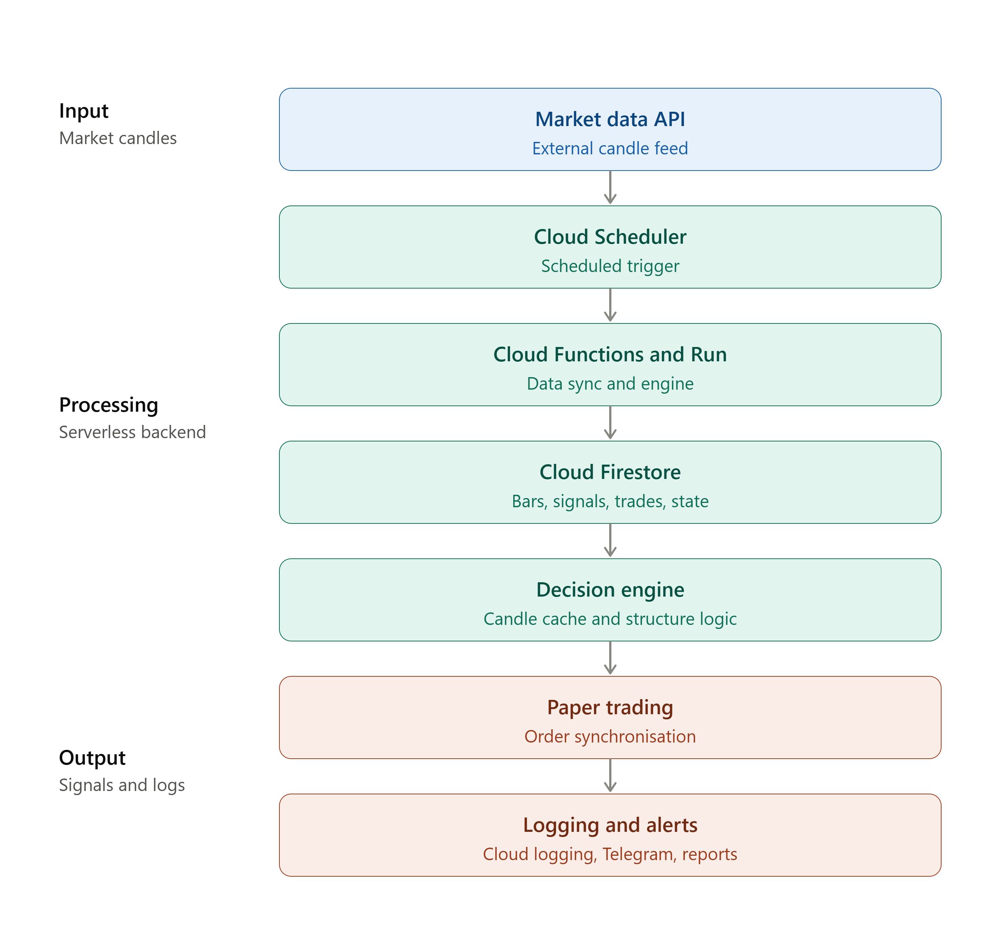
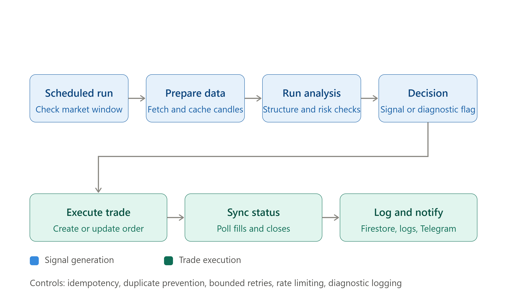

# WyckoffTraderPro

## Cloud Engineering & Trading Automation Portfolio

> A personal engineering case study covering cloud-based market-data processing, trading automation, paper-trading workflows, monitoring, troubleshooting and cost-conscious system design.

**Main source code:** kept in a separate private repository.

---

## Project Overview

WyckoffTraderPro is a personal cloud-based trading-engineering project designed to process market data, evaluate market structure and trading setups, generate trading signals and support paper-trading analysis.

The project focuses on building a workflow that is structured, traceable, explainable, monitorable and cost-conscious.

## High-Level Architecture



## Signal & Paper-Trade Workflow



The workflow moves from scheduled data processing through analysis, signal generation, paper execution, order synchronisation and operational visibility.

---

## Main Objectives

- Process market data efficiently
- Detect market structure and trading setups
- Generate and track trading signals
- Support paper-trading workflows
- Synchronise order and trade status
- Investigate runtime and operational errors
- Monitor system behaviour through logs and notifications
- Control cloud usage and API costs
- Support backtesting and shadow-mode analysis

---

## My Role

As the project owner and developer, I designed, developed, operated and improved the overall workflow.

Responsibilities included:

- Developing JavaScript / Node.js functions
- Integrating market-data and paper-trading APIs
- Designing Firestore data flow
- Building scheduled processing workflows
- Investigating runtime and synchronisation issues
- Reviewing cloud logs and operational failures
- Applying caching, batching and retry strategies
- Performing backtesting and shadow analysis
- Documenting architecture and technical lessons

---

## Technology Stack

| Area | Technologies / Concepts |
|---|---|
| Programming | JavaScript, Node.js, Python for selected analysis tasks |
| Cloud | Google Cloud Functions, Cloud Run runtime, Firebase ecosystem |
| Database | Cloud Firestore |
| Scheduling | Cloud Scheduler |
| Monitoring | Cloud Logging and diagnostic records |
| Integration | Market-data API, paper-trading API, Telegram Bot API |
| Development | Visual Studio Code, Git and GitHub |
| Analysis | CSV / JSON processing, backtesting and shadow-mode analysis |

---

## Engineering Challenges

### Signal Consistency

Investigated signal flow between live signals and paper-trading signals, including duplicate-signal handling and missed-signal scenarios.

### Weak or Rejected Setups

Reviewed setup confirmation, risk-reward requirements and confidence levels to make signal decisions more traceable.

### Cloud Runtime Errors

Investigated serverless runtime errors, function exports/imports and incorrectly referenced functions.

### Order Synchronisation

Reviewed polling, order-status updates, terminal states and manual-close detection.

### Telegram Notification Problems

Investigated HTTP errors and message-length limitations affecting trading notifications.

### API and Cloud Cost Pressure

Applied incremental fetching, batching, caching, bounded retries and targeted database queries.

---

## Cost Optimisation Practices

- Incremental market-data retrieval
- Controlled historical backfill
- Multi-symbol and batch processing
- Rate limiting and HTTP 429 handling
- Bounded retry and exponential backoff
- Recent-candle tail caching
- Deterministic candle identifiers
- Batched Firestore writes
- Targeted queries for active and due trades
- Terminal-state filtering
- Scheduled polling controls
- Housekeeping and retention practices
- Budget monitoring and cost review

---

## Repository Structure

```text
WyckoffTraderPro-Portfolio/
|
|-- README.md
|
|-- docs/
|   `-- WyckoffTraderPro_Portfolio_WaNZuL-Pro.pdf
|
|-- screenshots/
|   |-- cloud-logging.png
|   |-- firestore-trade-record.png
|   |-- telegram-notification.png
|   `-- github-repository.png
|
`-- diagrams/
    |-- architecture-diagram.png
    `-- workflow-diagram.png
```

## Portfolio Documents

- [Project Portfolio](docs/WyckoffTraderPro_Portfolio_WaNZuL-Pro.pdf)

---

## Portfolio Evidence

- [Project Screenshots](screenshots/)

Selected evidence may include:

- Cloud deployment
- Runtime logs
- Firestore records
- Trading signal flow
- Paper-trade status
- Telegram notifications
- System architecture
- Troubleshooting examples
- Cost-optimisation practices

---

## Security and Source Code

The main application source code remains in a separate **private repository**.

Will not publish:

- API keys
- Trading account credentials
- Telegram bot tokens
- Firebase service-account files
- Private keys
- `.env` files
- Private database exports
- Sensitive personal or account information
- Internal production configuration
- Full private application source code

---

## Project Status

WyckoffTraderPro is an evolving personal engineering project.

Future improvements may include more detailed diagrams, additional screenshots, public-safe code examples, testing documentation, deployment notes and troubleshooting case studies.

---

## Disclaimer

This project is presented as a **cloud engineering, automation and paper-trading case study**.

Any trading objectives, strategy results or historical analysis are provided for engineering and analysis context only. They are not financial advice and are not a guarantee of future trading performance.
